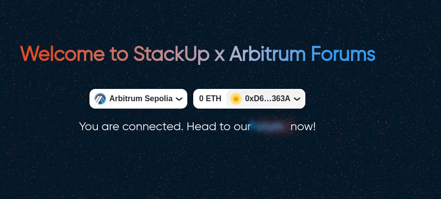
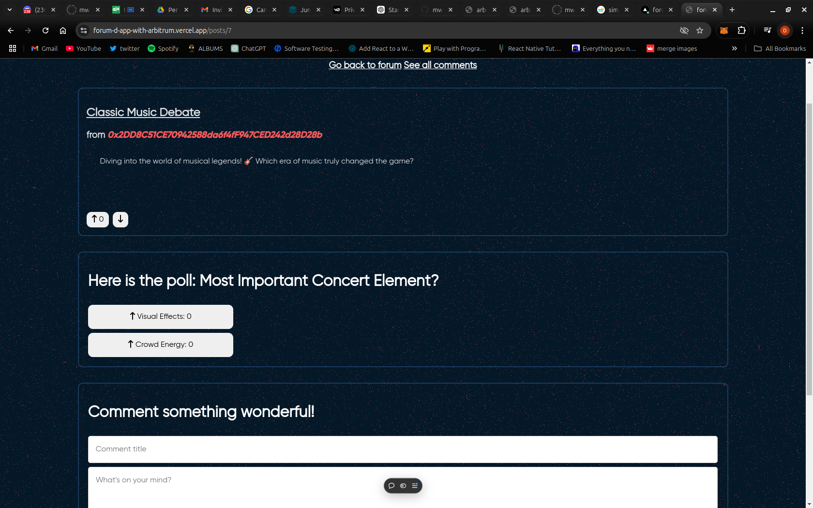

# Forum Dapp
Forum dApp - decentralized application that enables users to create posts, add comments, conduct polls and engage contents through likes.

## Key Components of the Forum dApp

#1 - Posts

Users can create posts that include a title and a description. Each post is uniquely identified by an ID and can be marked with a “spoil” flag if the content contains spoilers.

Posts are dynamic and can receive upvotes or downvotes from other users, which directly impacts the post’s popularity and visibility within the forum.

#2 - Comments

Users can add comments to posts, sharing their opinions or thoughts. Each comment is directly linked to a specific post and, like posts, can be flagged as containing spoilers if necessary.

Comments, too, can be upvoted or downvoted, allowing users to express their approval or disapproval of the content.

#3 - Polls

Users have the ability to create polls associated with a particular post. Each poll includes a question and two options for users to vote on.

Other users can participate in these polls by selecting one of the two options. The results of the poll are tracked and stored on the blockchain, ensuring they are transparent and immutable.

#4 - Likes

Both posts and comments can receive likes (upvotes) or dislikes (downvotes), allowing the community to signal which content they find most valuable or relevant.

